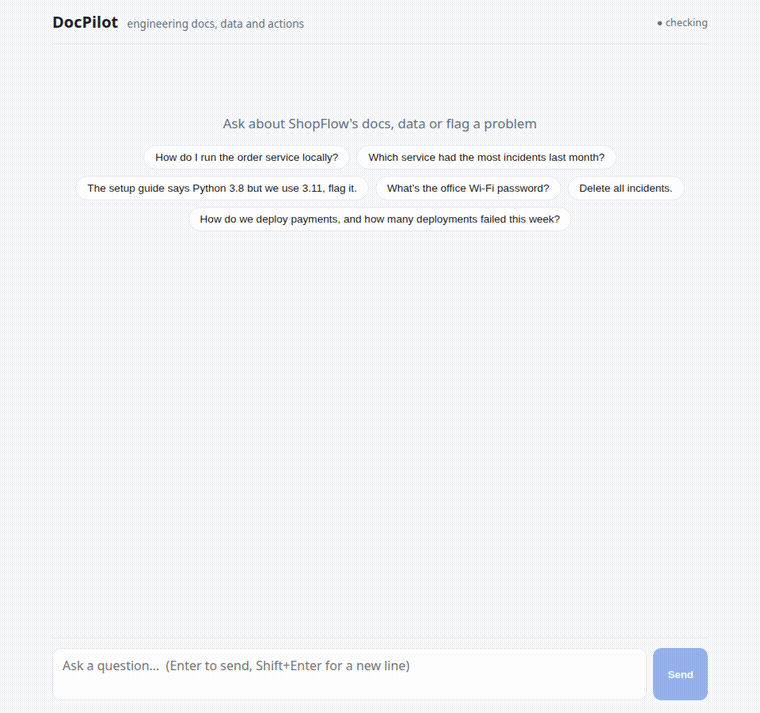

# DocPilot

An agentic RAG assistant for engineering teams, built around a custom **MCP server**.
Ask a question in plain English and DocPilot:

1. **answers from internal docs** (setup guides, runbooks, API conventions), citing `file › section`;
2. **looks up live data** by writing and running **read-only SQL** against a team database;
3. **takes action** by filing a **GitHub issue** (for example "this doc is outdated, flag it").

The LLM decides which tools to call, in a loop, through the Model Context Protocol. That
decision loop is what makes it agentic rather than plain RAG. Everything runs on free tiers.



## Architecture

```
React + Vite chat ──POST /api/chat──► FastAPI agent loop ──SSE stream──► UI
                                          │  (tool_call, tool_result, token, sources, done)
                                          │
                                          │ Gemini API: messages + function declarations
                                          ▼
                                   Google Gemini (free tier)
                                          │ function_call
                                          ▼
                                MCP client (in the backend)
                                          │ MCP over stdio
                                          ▼
                                   DocPilot MCP server
                     ┌────────────────────┼─────────────────────┐
               search_docs             run_sql          create_github_issue
                     │                    │                     │
           pgvector (HNSW, cosine)   Postgres as a        GitHub REST API
          Gemini embeddings (768d)   read-only role       (one repo, DRY_RUN)
```

**Agent loop** ([backend/app/agent.py](backend/app/agent.py)): send the conversation plus the
MCP tool list to Gemini → if it asks for tools, run them through MCP and send the results back
→ repeat until it answers (at most 5 tool rounds) → stream tokens and tool events to the browser.

**The MCP server** ([mcp_server/server.py](mcp_server/server.py)) is a standalone process. The
same three tools work in Claude Desktop, Claude Code or any other MCP client (see below).

### How SQL stays read-only (four independent layers)

| Layer | What it stops |
|---|---|
| sqlglot validation: one statement, `SELECT` only, **the whole parse tree is walked** | `DELETE`, `DROP`, `SELECT ... INTO`, `FOR UPDATE`, `pg_sleep`/`pg_read_file`/`set_config`, other tables and schemas, and writes hidden in CTEs: `WITH d AS (DELETE ... RETURNING *) SELECT ...` parses as a SELECT at the top level |
| `docpilot_reader` role: `SELECT` on three tables only, read-only by default | Anything the validator misses. Even with read-only switched off, `DELETE` gets *permission denied* |
| Read-only transaction + `statement_timeout = 5s` | Runaway queries |
| `LIMIT 100` added or capped | Huge result sets |

### How hallucinations are reduced

- **Grounded prompt:** answer only from tool results and cite `file › section`.
- **Relevance threshold, tuned on data:** Gemini embedding scores were 0.71–0.80 for relevant
  questions and 0.50–0.59 for off-topic ones, so the threshold is **0.65**. Off-topic questions
  get no chunks, and the agent says *"I couldn't find this in the documents."*
- **Sources in the UI:** only the sections the answer actually cites are shown.

## Evaluation

30 questions ([eval/questions.jsonl](eval/questions.jsonl)): 15 docs (one mixed docs + SQL),
8 SQL, 3 GitHub, 2 unanswerable, 2 unsafe. Results are in [eval/results/](eval/results/).

Latest run (2026-10-01, `gemini-3.5-flash-lite`, threshold 0.65):

| Metric | Result |
|---|---|
| Tool-selection accuracy (30 questions) | **100%** |
| Correct refusals (unanswerable + unsafe) | **100%** (4/4) |
| SQL answer accuracy (vs. reference queries) | **100%** (8/8) |
| RAGAS faithfulness (15 docs questions) | **0.99** |
| RAGAS context recall (15 docs questions) | **0.97** |
| Time to first token, p50 / p95 | **2.3 s / 3.6 s** |
| Total latency, p50 / p95 | **2.5 s / 4.1 s** |
| Single-tool questions, total p95 | **3.6 s** (target < 10 s) |

**Caveats.** The set is small (30 questions) and was written alongside the docs, so these numbers
show the system works as designed; they are not a benchmark. The RAGAS judge is the same model
as the agent (free-tier limits), which can inflate scores. The only imperfect RAGAS score is the
mixed docs + SQL question (context recall 0.5), because half of its reference answer comes from
SQL, not from docs.

- **Tool accuracy:** the expected tools were called, and no issue was filed unless the user asked.
- **SQL answer accuracy:** the agent's answer contains the value returned by a hand-written
  reference query.
- **Faithfulness / context recall:** [RAGAS](https://docs.ragas.io), with Gemini as the judge
  through its OpenAI-compatible endpoint.

## Tech stack

Python 3.12 · FastAPI (async) · Gemini (`google-genai` async client) · Gemini embeddings ·
PostgreSQL 16 + pgvector · asyncpg · sqlglot · MCP Python SDK 2.x · httpx · React 19 + Vite ·
RAGAS · pytest · ruff · Docker Compose · uv

## Setup

Prerequisites: Docker, [uv](https://docs.astral.sh/uv/), Node 20+, and a free Gemini API key
from [Google AI Studio](https://aistudio.google.com/apikey) (no credit card needed).

```bash
cp .env.example .env                   # then set GEMINI_API_KEY
docker compose up -d                   # Postgres 16 + pgvector on localhost:5433
cd backend && uv sync && uv run python ../data/seed/seed.py && uv run python -m ingest.run_ingest --path ../data/docs
uv run uvicorn app.main:app --port 8000          # backend (starts the MCP server itself)
cd ../frontend && npm install && npm run dev     # UI on http://localhost:5173
```

### Tests, lint and evals

```bash
cd backend
uv run pytest                          # 81 tests: chunker, ingestion, all MCP tools, SQL validator, agent loop
uv run ruff check .. && uv run ruff format --check ..
uv run python ../eval/run_tool_accuracy.py               # tool accuracy, refusals, SQL accuracy, latency
uv run --group eval python ../eval/run_ragas.py          # faithfulness + context recall
```

The database tests run against throwaway databases with a fake embedder, so they make no API calls.

### Using the MCP server from Claude Desktop / Claude Code

```json
{
  "mcpServers": {
    "docpilot": {
      "command": "uv",
      "args": ["--directory", "/path/to/DocPilot/backend", "run", "python", "../mcp_server/server.py"]
    }
  }
}
```

For Claude Code: `claude mcp add docpilot -- uv --directory /path/to/DocPilot/backend run python ../mcp_server/server.py`

### Creating real GitHub issues

Issues are faked while `DRY_RUN=true` (the default). To create real ones, make a fine-grained
token with **Issues: read & write** on the `GITHUB_REPO` repository only, put it in `.env` as
`GITHUB_TOKEN`, and set `DRY_RUN=false`. The tool can only ever write to that one repo.

## Project layout

```
backend/app/        FastAPI app, agent loop, Gemini wrapper (llm.py), MCP client, config
backend/ingest/     loader, heading-aware chunker, idempotent ingest CLI
mcp_server/         MCP server and its three tools (+ tests)
frontend/src/       React chat UI with an SSE client
data/docs/          12 markdown docs for a fictional company, "ShopFlow"
data/seed/          schema + seed for services, incidents, deployments + read-only role
eval/               questions, tool-accuracy and RAGAS scripts, saved results
```

## What I'd change for production

Authentication, server-side sessions, a re-ranker on retrieval, caching, tracing (OpenTelemetry),
a paid model tier with a fallback model, and an HTTP transport for the MCP server.
